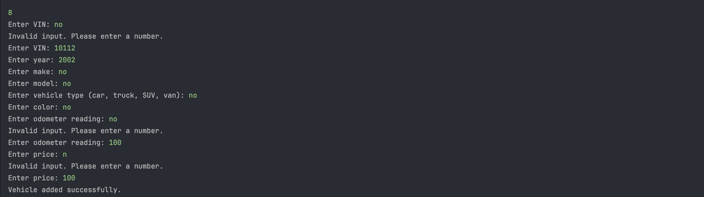

# Car Dealership Management App

This is a simple Java-based console application designed to help car dealership staff manage their vehicle inventory. The app supports searching for vehicles, adding new entries, removing sold vehicles, and viewing all available inventory.

##  Features

Users can:
-  Search vehicles by:
    - Price range
    - Make and model
    - Year range
    - Color
    - Mileage range
    - Type (Car, Truck, SUV, Van)
-  View all available vehicles
-  Add a new vehicle
-  Remove a vehicle
-  All changes are persisted to a text file (`inventory.txt`)

##  File Structure

── Vehicle.java // Represents a single vehicle

── Dealership.java // Holds dealership info and vehicle inventory

── DealershipFileManager.java // Loads and saves from/to inventory.txt

── UserInterface.java // User interaction and menu logic

── Main.java // App entry point

##  Data Format

The inventory is stored in a pipe-delimited file (`inventory.txt`):

- Line 1: Dealership info

- Subsequent lines: One vehicle per line

**Example:**
D & B Used Cars|111 Old Benbrook Rd|817-555-5555

**Example:**
10112|1993|Explorer|Ford|SUV|Red|525123|995.0


---

#  Screenshots

##  Home Screen (Main Menu)


> User can see all available operations.

---

##  Products Display Screen


> Shows all vehicles with VIN, year, make/model, type, mileage, and price.

---

##  Add Vehicle with Invalid Input


> Demonstrates validation logic. User enters non-numeric input for price → app shows error and reprompts.

---

##  Interesting Code 

```java
private double getValidatedDouble(String prompt) {
    while (true) {
        try {
            System.out.print(prompt);
            return Double.parseDouble(scanner.nextLine());
        } catch (NumberFormatException e) {
            System.out.println("Invalid input. Please enter a number.");
        }
    }
}

//This method is essential to prevent the app from crashing since it will
//loop untill the user enteres a valid number.

